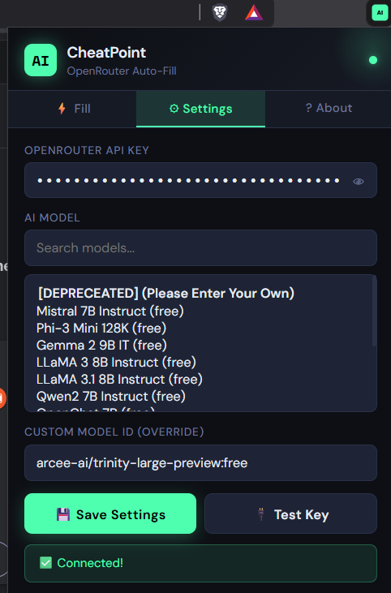

# DEPRECATED NO LONGER IN PRODUCTION | THIS IS A ONCE OFF FOR FUN PROJECT NON-SEC RELATED
# CheatPoint – Auto-Fill Any Form Using AI 

CheatPoint is a Chrome extension that automatically fills out forms on any webpage (Google Forms, surveys, sign-ups) using AI via OpenRouter's free models.  

Built to save time and make repetitive form-filling easy, while letting you customize the AI context for personalized answers.

---

## Features

- Auto-detects text fields, dropdowns, checkboxes, and radio buttons.
- Works on Google Forms, including custom div-based inputs.
- Use free OpenRouter models like Mistral, LLaMA, and more.
- Optional context input so AI can personalize responses.
- Preview AI-generated answers before applying them.
- Lightweight and fully client-side, your API key stays local.

---

## Screenshots

  

---

## Google Drive Demo Cuz Github wont let me upload a 25mb mp4 lol
[Watch the demo video](https://drive.google.com/file/d/1s1z9gfkzfDpGSf0uRJLYCwWZ4TkaXNCm/view)

## Installation (Developer Mode)

1. Open Chrome and go to `chrome://extensions/`.
2. Enable **Developer mode** (top right).
3. Click **Load unpacked** and select the `cheatpoint-extension/` folder.
4. The FormAI icon will appear in your toolbar ✅

---

## Setup

1. Get a free API key from [OpenRouter](https://openrouter.ai) (Sign up → Dashboard → API Keys → Create Key).
2. Click the CheatPoint icon in Chrome.
3. Go to **Settings**, paste your API key, and select a free model.
4. Save settings and optionally **Test Key**.

---

## How to Use

1. Open any webpage with a form.
2. Click the CheatPoint icon.
3. On the **Fill** tab, add context if desired:
   > "I am a 22-year-old software engineering student from Malaysia"
4. Click **Scan Page for Fields** detected fields will highlight green.
5. Click **Generate & Fill** AI generates answers.
6. Review the preview, then click **Apply to Form**.
7. Double-check everything before submitting.

---

## Free Models Available

| Model | Notes |
|-------|-------|
| `mistralai/mistral-7b-instruct:free` | Best overall free option |
| `meta-llama/llama-3.1-8b-instruct:free` | Great reasoning |
| `google/gemma-2-9b-it:free` | Google's free model |
| `microsoft/phi-3-mini-128k-instruct:free` | Handles long context |
| `qwen/qwen-2-7b-instruct:free` | Fast responses |

---

## Limitations

- Cannot bypass CAPTCHA.
- Some heavily JavaScript forms may require a refresh.
- AI answers may not be perfect review before submitting.
- Google Forms uses custom inputs, so results may vary.

---

## Privacy

- API key is stored locally in Chrome's `sync` storage.
- Page content is sent to OpenRouter for processing.
- No data is stored beyond your settings.

---

## Contributing

If you want to help improve CheatPoint:

1. Fork the repo
2. Make your changes
3. Open a pull request  

Feel free to report issues or request new features via GitHub Issues.

---

## License

MIT License To yo mama
